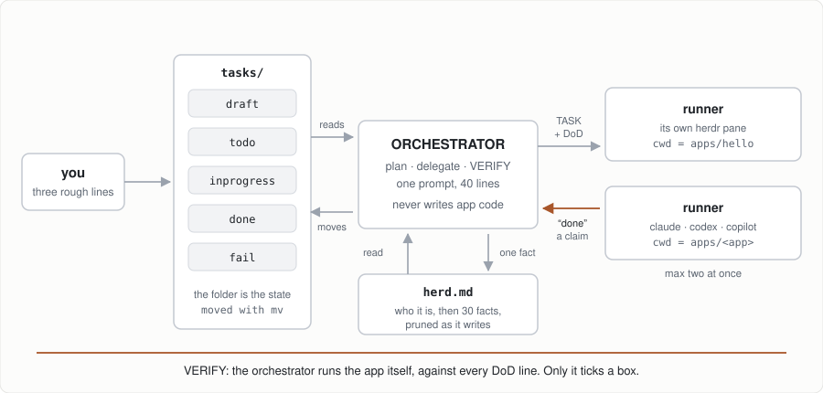

# myherd — build your own orchestrator

<p align="center">
  
</p>

**Rough notes in, working apps out, and nothing believed until it runs.** That picture is the whole kit: a folder is the board, a prompt is the orchestrator, each task gets an agent in its own pane, and `herd.md` is the only thing it remembers between rounds.

An evening. One folder, one prompt, one terminal multiplexer. By the end you have an agent that plans work from your rough notes and hands each task to another agent in its own pane, then checks the result. Everything after that is yours to hack.

## Before you come

| need | check |
|---|---|
| Claude Code, Copilot CLI or Codex, logged in | `claude -p "say ok"` · `copilot -p "say ok"` · `codex exec "say ok"` |
| herdr | `herdr --version` → 0.8 or later, https://herdr.dev |
| jq | `jq --version` |
| git | `git --version` |

Windows: WSL 2 with the checkout inside the WSL filesystem. Details and the sandbox packages are in `docs/sandboxing.md`.

## The kit

One file: `ORCHESTRATOR.md`, 40 lines, written as a term bank plus keyword lines. The first `run` builds the rest:

```
CLAUDE.md  AGENTS.md  .github/copilot-instructions.md    one line each: read ORCHESTRATOR.md
tasks/draft todo inprogress done fail                     the kanban board, moved with mv
tasks/draft/hello-cli.md        your first task, written badly on purpose
herd.md                         who this herd is, in its own words, then the facts it keeps: 30 at most, pruned as it writes
apps/                           where runners build, each app its own git repo
docs/                           OKF bundle the orchestrator writes: index, log, how-it-works
bin/                            TOOLs, git-ignored: scripts the prompts define, written the moment one is needed
```

No scripts. No scaffold. No state but the folder itself, and the prompt knows how to make it — including `herd.md`, which the orchestrator writes about itself on the first run and prunes back to 30 facts on every one after. Anything the herd runs more than once is a TOOL: its whole definition is a line in a prompt, the orchestrator writes it into `bin/` when it is first needed and rewrites it when the line changes. Nothing but prompts in git; one allow rule covers every plugin, and no agent ever edits its own permissions.

`docs/` in this repo is reading material for you: `runners.md`, `sandboxing.md`, `hack-ideas.md`. `plugins/` holds seven plugins, each one prompt file that installs itself as a single git commit and uninstalls with `git revert`.

## The evening

1. **Copy `ORCHESTRATOR.md`** into an empty folder of your own. Claude Code as orchestrator: also `.claude/settings.json` with `{"permissions":{"allow":["Bash(bin/*)"]}}` — the one rule the TOOLs need, and the classifier will not let an agent write it. Nothing else.
2. **Start herdr**: `herdr --session workshop`. Inside it, `cd` to your folder and start your harness: `claude`, `copilot` or `codex`. Answer the harness's "trust this folder?" question first; a prompt typed before that is lost.
3. **Type `run`.** Watch the orchestrator build the folder, rewrite `hello-cli.md` into a real task, open a pane, start a runner. Type `run` again when the runner is idle. It verifies by running your app and moves the file to `done/` or `fail/`.
4. **Write your own draft.** Three rough lines in `tasks/draft/`. `run`.
5. **Add a plugin.** Say `read <path>/plugins/canary.md and execute`. The prompt installs itself: copies into `plugins/`, wires the pointer files, writes a registry file under `docs/plugins/`, commits once. `run` now prints `PLUGIN OK canary`. Say `remove plugin canary`: one `git revert`, gone. Then the real ones: `visualize`, `traceability`, `sandbox-claude`, `sandbox-copilot`. `canvas` is different: it installs a task, a runner builds the server and page, and from then on every round posts to a browser tab at `127.0.0.1:7778`.
6. **Hack.** Write your own plugin from `docs/hack-ideas.md`. Same shape: INSTALL, REMOVE, RULES, one file.

## What to notice

- The orchestrator never wrote code. Look at `apps/hello`: the runner did.
- "Done" from the runner was not enough. The orchestrator ran the program against the task's DoD, the task's own lines plus a baseline every task inherits.
- The board is `ls tasks/*/`. There is nothing to install to see state, and nothing was scaffolded: the prompt built its own folder.
- Swap the harness. `CLAUDE.md`, `AGENTS.md` and `copilot-instructions.md` point to the same prompt, so Copilot can orchestrate Claude runners or the other way round.

## Facilitator notes

- The four gotchas in `docs/runners.md` will each hit someone. Let them, then point at the doc.
- A runner takes one to three minutes for hello-cli. Use the wait to explain the gate idea.
- If herdr is missing, the kit still works as a single-agent loop: skip the pane and let the orchestrator do the task itself. Say out loud what was lost.
- Sandboxing is a reference, not a step. Bring it up when someone's runner does something surprising.
